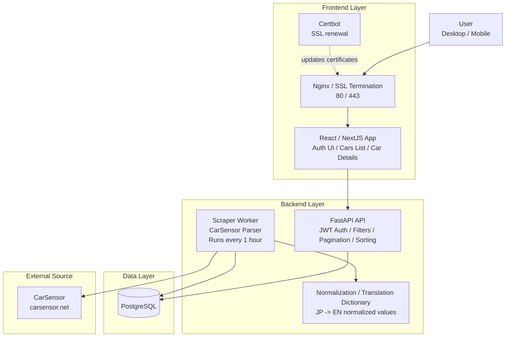

# Million Miles — Used Car Listings

> Test assignment: web scraper + REST API + React SPA for browsing used car listings from [CarSensor.net](https://www.carsensor.net/).

---

## Table of Contents

1. [Project Overview](#project-overview)
2. [Tech Stack](#tech-stack)
3. [Architecture](#architecture)
4. [Getting Started](#getting-started)
5. [Environment Variables](#environment-variables)
6. [API Reference](#api-reference)
7. [Scraper](#scraper)
8. [Frontend](#frontend)
9. [Design Decisions & Notes](#design-decisions--notes)

---

## Project Overview

**Million Miles** is a full-stack application that:

- **Scrapes** used car listings from CarSensor.net every hour, normalises the Japanese-language data into English, and persists it to a PostgreSQL database.
- **Serves** the data through a FastAPI REST backend with JWT authentication, filtering, sorting, and pagination.
- **Displays** the listings in a React (Vite + TypeScript + Tailwind CSS) single-page application with a login page, a filterable car catalogue, and individual car detail pages.

---

## Tech Stack

| Layer | Technology |
|---|---|
| Database | PostgreSQL 16 |
| Backend | Python 3.13, FastAPI, SQLAlchemy 2 (async), Alembic |
| Scraper | Python 3.13, httpx / requests, BeautifulSoup 4 |
| Frontend | React 18, TypeScript, Vite, Tailwind CSS v4, React Router v6 |
| Container | Docker, Docker Compose |
| SSL | Nginx + Let's Encrypt (Certbot) |

---

## Architecture



- The **scraper** container runs `run_scraper.py` in an infinite loop (default interval: 3 600 s).
- The **api** container runs Alembic migrations on start, seeds the admin user, then launches Uvicorn.
- The **frontend** container builds the React app and serves it with Nginx, which also reverse-proxies `/api/` to the backend.
- **Certbot** renews the Let's Encrypt certificate every 12 hours.

---

## Getting Started

### Prerequisites

- [Docker](https://docs.docker.com/get-docker/) ≥ 24
- [Docker Compose](https://docs.docker.com/compose/) plugin (bundled with Docker Desktop)

### 1. Clone the repository

```bash
git clone https://github.com/SergeyKalutsky/million-miles-test.git
cd million-miles-test
```

### 2. Create the `.env` file

Copy the example below and fill in your values:

```dotenv
# PostgreSQL
POSTGRES_USER=mmuser
POSTGRES_PASSWORD=strongpassword
POSTGRES_DB=million_miles

# Used by FastAPI (asyncpg driver)
DATABASE_URL=postgresql+asyncpg://mmuser:strongpassword@db:5432/million_miles

# JWT — generate with: openssl rand -hex 32
SECRET_KEY=replace_me_with_a_real_secret

# Scraper
SCRAPER_LIVE=1          # 0 = offline/dry-run, 1 = fetch real data
SCRAPER_INTERVAL=3600   # seconds between scraper runs
```

### 3. Build and start all services

```bash
docker compose up --build -d
```

The first run will:

1. Pull/build all images.
2. Start PostgreSQL and wait until it is healthy.
3. Run Alembic migrations (`alembic upgrade head`).
4. Seed the default admin account (`admin` / `admin123`).
5. Start the scraper (first run fires immediately).

### 4. Open the app

| Service | URL |
|---|---|
| Frontend | http://localhost |
| API docs (Swagger) | http://localhost:8000/docs |
| API docs (ReDoc) | http://localhost:8000/redoc |
| Health check | http://localhost:8000/health |

Log in with **admin / admin123**.

### Stopping

```bash
docker compose down          # stop containers, keep volumes
docker compose down -v       # also delete the database volume
```

---

## Environment Variables

| Variable | Default | Description |
|---|---|---|
| `POSTGRES_USER` | — | PostgreSQL username |
| `POSTGRES_PASSWORD` | — | PostgreSQL password |
| `POSTGRES_DB` | — | PostgreSQL database name |
| `DATABASE_URL` | — | Full async SQLAlchemy connection string |
| `SECRET_KEY` | — | HS256 signing key for JWTs |
| `ACCESS_TOKEN_EXPIRE_MINUTES` | `60` | JWT lifetime in minutes |
| `SCRAPER_LIVE` | `0` | `1` = fetch real pages, `0` = dry-run |
| `SCRAPER_INTERVAL` | `3600` | Seconds between scraper runs |
| `DEBUG` | `false` | Enable FastAPI debug mode |

---

## API Reference

All protected endpoints require the header:

```
Authorization: Bearer <token>
```

### Authentication

| Method | Path | Auth | Description |
|---|---|---|---|
| `POST` | `/auth/login` | ✗ | Login; returns `access_token` |
| `POST` | `/auth/register` | ✗ | Register a new user |
| `GET` | `/auth/me` | ✓ | Return the current user |

**Login request** (form-encoded):

```
username=admin&password=admin123
```

**Login response**:

```json
{
  "access_token": "<jwt>",
  "token_type": "bearer"
}
```

### Cars

| Method | Path | Auth | Description |
|---|---|---|---|
| `GET` | `/cars/` | ✓ | Paginated, filtered, sorted car list |
| `GET` | `/cars/{id}` | ✓ | Single car detail |

#### `GET /cars/` query parameters

| Parameter | Type | Description |
|---|---|---|
| `brand` | `string[]` | Filter by brand (repeatable, case-insensitive) |
| `model` | `string` | Partial model name match |
| `body_type` | `string` | Exact body type (e.g. `sedan`) |
| `fuel_type` | `string` | Exact fuel type (e.g. `gasoline`) |
| `transmission` | `string` | `automatic` or `manual` |
| `color` | `string` | Exact colour |
| `location` | `string` | Partial prefecture match |
| `year_min` / `year_max` | `int` | Year range |
| `price_min` / `price_max` | `int` | Price range in JPY |
| `mileage_max` | `int` | Maximum mileage in km |
| `sort_by` | `string` | `price_jpy`, `mileage_km`, `year`, `created_at` |
| `order` | `string` | `asc` or `desc` |
| `page` | `int` | Page number (default: `1`) |
| `page_size` | `int` | Items per page (default: `20`, max: `100`) |

Full interactive documentation is available at `/docs` (Swagger UI).

---

## Scraper

### How it works

1. **Listing phase** — fetches the first 10 pages of CarSensor search results and extracts detail-page URLs from embedded `application/ld+json` data.
2. **Detail phase** — visits each detail page and parses the structured HTML to extract all available fields (brand, model, year, mileage, price, colour, transmission, body type, location, photos, etc.).
3. **Normalisation** — all Japanese text is translated to English using hand-crafted lookup dictionaries (`normalizers.py`):
   - `BRAND_MAP` — ~50 car brands
   - `MODEL_MAP` — hundreds of model names
   - `BODY_TYPE_MAP`, `FUEL_TYPE_MAP`, `TRANSMISSION_MAP`, `COLOR_MAP` — spec values
   - Numeric values (prices in 万円, mileages in 万km) are converted to plain integers.
4. **Persistence** — records are upserted by `external_id` (the CarSensor listing ID), so re-running the scraper never creates duplicates.

### Scraper limits

Only the **first 10 listing pages** are scraped per run (~200–300 listings depending on page size). This is an intentional restriction to avoid putting unnecessary load on CarSensor's servers during a test assignment. The limit is controlled by `LISTING_URLS` in `scraper/config.py` and can be raised trivially.

### Running the scraper manually

```bash
# Live run (fetches real data)
docker compose exec scraper python -m scraper.run_scraper

# Or with the env var override
SCRAPER_LIVE=1 docker compose run --rm scraper python /app/scraper/run_scraper.py
```

---

## Frontend

- Built with **React 18**, **TypeScript**, **Vite**, and **Tailwind CSS v4**.
- **Adaptive layout** — fully responsive for desktop and mobile viewports.
- **Pages**:
  - `/login` — login form (JWT stored in `localStorage`).
  - `/cars` — filterable, paginated car catalogue with brand multi-select, facet dropdowns, price/year/mileage range filters, and sort controls.
  - `/cars/:id` — car detail page with photo gallery and full spec table.
- The Nginx configuration inside the frontend container proxies `/api/*` requests to the FastAPI backend, so the browser never needs to know the backend's address directly.

---

## Design Decisions & Notes

### Authentication — no refresh token

The task specification required only basic JWT login (username + password → token). **No refresh token** mechanism was implemented, as it was not part of the requirements. The access token lifetime is 60 minutes and is configurable via `ACCESS_TOKEN_EXPIRE_MINUTES`.

### UI language — English

The application interface is entirely in **English**. The job description did not specify a UI language, and English was chosen as the professional default in the absence of an explicit requirement.

### Scraper — first 10 pages only

To avoid hammering CarSensor's servers during a test assignment, the scraper is limited to the **first 10 pages** of search results per run. This yields a representative dataset of roughly 200–300 listings without abusing the target site.

### Japanese → English normalisation

CarSensor publishes all data in Japanese. A hand-crafted translation layer (`scraper/normalizers.py`) maps Japanese brand names, model names, fuel types, transmissions, colours, and body types to their English equivalents. Numeric values expressed in Japanese units (万円 for price, 万km for mileage) are converted to plain integers (JPY and km respectively).

### Database upsert strategy

The scraper identifies each listing by its `external_id` (the unique ID in the CarSensor URL). On every run, existing records are updated and new ones are inserted — duplicate listings are never created.
